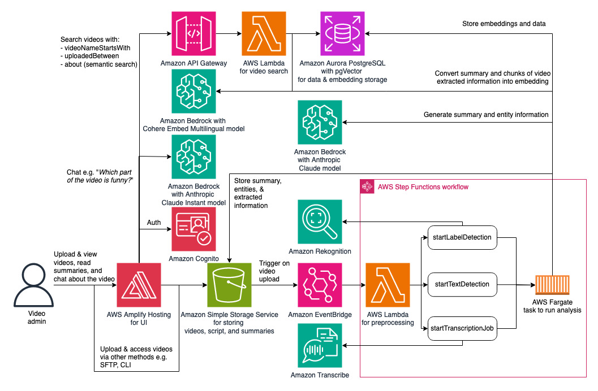

# Video Understanding Solution

## Introduction

This is a deployable solution to help save your time in understanding videos without having to watch every video. You can upload videos and this solution can generate AI-powered summary and entities extraction for each video. It also supports Q&A about the video like "What is funny about the video?", "How does Jeff Bezos look like there?", and "What shirt did he wear?". You can also search for videos using semantic search e.g. "Amazon's culture and history". This solution extracts information from visual scenes, audio, visible texts, and detected celebrities or faces in the video. It leverages an LLM which can understand visual and describe the video frames.

You can upload videos to your Amazon Simple Storage Service (S3) bucket bucket by using AWS console, CLI, SDK, or other means (e.g. via AWS Transfer Family). This solution will automatically trigger processes including call to Amazon Transcribe for voice transcription, call to Amazon Rekognition to extract the objects visible, and call to Amazon Bedrock with Claude 3 model to extract scenes and visually visible text. The LLM used can perform VQA (visual question answering) from images (video frames), which is used to extract the scene and text. This combined information is used to generate the summary and entities extraction as powered by generative AI with Amazon Bedrock. The UI chatbot also uses Amazon Bedrock for the Q&A chatbot. The summaries, entities, and combined extracted information are stored in S3 bucket, available to be used for further custom analytics. Refer to the diagram below on the architecture.

Note that the architecture diagram may not represent all the components and relations for readability. The Amazon Aurora PostgreSQL database is deployed in Amazon VPC with isolated subnet spanning across 3 availability zones. The Fargate task for analysis, the video search Lambda function, and the preprocessing Lambda function are all deployed in the VPC with private subnet.

Refer to the Deployment section below on how to deploy it to your own AWS account. Refer to the Use section on how to use it.

## Deployment

### Prerequisites

Here are prerequisites for deploying this solution with AWS CDK:

1. AWS account with Amazon Bedrock model access enabled for Anthropic - Claude, Anthropic - Claude Instant and Cohere - Embed Multilingual. Follow the steps in https://docs.aws.amazon.com/bedrock/latest/userguide/model-access.html#add-model-access to enable those models and make sure the region is correct.
2. Make 3.82 or above in your environment
3. AWS IAM credentials with sufficient permission for deploying this solution configured in your environment. See https://docs.aws.amazon.com/cli/latest/userguide/cli-configure-files.html for credentials setup.
4. AWS CLI 2.15.5 or above / 1.29.80 or above. Follow https://docs.aws.amazon.com/cli/latest/userguide/getting-started-install.html for installation.
5. Python 3.8 or above, pip, and virtualenv.
6. Docker 20.10.25 or above
7. NodeJS 16 with version 16.20.2 above, or NodeJS 20 with version 20.10.0 or above, along with NPM.
8. jq, zip, unzip
9. CDK Toolkit 2.122.0 or above. Follow https://docs.aws.amazon.com/cdk/v2/guide/getting_started.html#getting_started_install for installation.
10. Python CDK lib 2.122.0 or above with @aws-cdk/aws-amplify-alpha. Follow https://docs.aws.amazon.com/cdk/v2/guide/getting_started.html#getting_started_concepts
11. CDK nag 2.28.16 or above.

To automatically install item 4-11 of those prerequisites run. `make prepare`

The `make prepare` utility is currently supported only for MacOS Ventura, Amazon Linux 2, and Amazon Linux 2023 operating systems.

### Deploy

**IMPORTANT**

At the moment,this solution can only be used in AWS regions where Amazon Bedrock is available.
At the time of the writing of this document, you can deploy and use this in us-east-1 (N. Virginia) and us-west-2 (Oregon) regions.

Follow the steps below for deploying this solution from your current environment

1. Make sure that all prerequisites are met. Please refer to the [Prerequisites](#prerequisites) section above.

2. Run `make bootstrap_and_deploy` and enter an email address and the region to deploy when prompted. Make sure the email address is valid to receive the login credentials.

3. [Optional] For second or later redeployment, run `make deploy` instead. Note that any change to the UI (under "webui" folder) is not redeployed with `make deploy`. For UI changes you can push them to the deployed CodeCommit repository directly or run `make destroy` followed by `make deploy`.

## Use

### First login
After a successful deployment, the email address inputted during deployment should receive an email with temporary password and the web UI portal URL. It can take 15 minutes or so after you receive the email until the deployment completion, so just wait if the web UI isn't ready. Visit the web UI, use the email address as username, and input the temporary password. Then reset the password. When presented with a QR code, that is for you to set the MFA. Use authenticator software like Google Authenticator from your phone to set the MFA. Enter the MFA code back to the UI. After a successful sign-in, you should be able to see the page that will display your uploaded videos.

### Uploading videos and checking analysis outputs
You can upload videos into the S3 bucket using the web UI. Or, you can upload them straight to the S3 bucket using other means, under folder "source" as also instructed in the web UI. Uploaded videos will automatically trigger asynchronous tasks. For each video wait for few minutes for the tasks to finish. The analysis will be displayed in the web UI. It will also be stored in S3 under folder "summary", "entities", "audio_transcript" (the formatted transcription result), and "video_timeline" (the combined extracted video raw information), which you can use for further custom analysis / machine learning by extending this solution.
 
### Using the web UI
In the web UI, you can search for videos in your S3 bucket. For each video found, you can view the video, see its summary, check the extracted entities, and ask the chatbot about the video e.g. "What is funny or interesting about the video?". The chatbot is equipped with memory for the current conversation, so the user can have a context-aware conversation with the bot. You can also search videos using the name prefix, uploaded date range, and what the video is about. The latter is powered by semantic search using LLM.

## Cost
The cost of using this solution is determined by the pricing and usage of the components being deployed. This includes, but not being limited to (not the exhaustive list):

1. Less variable components:

    1.1. Amazon Aurora PostgreSQL - Pricing is [here](https://aws.amazon.com/rds/aurora/pricing/). This solution by default uses 2 x 0.5 ACU of Aurora Serverless PostgreSQL.

    1.2. NAT Gateway - Pricing is [here](https://aws.amazon.com/vpc/pricing/). This is used for egress access of Fargate task and some Lambda function. By default this solution uses 1 NAT Gateway.

2. More variable components (driven mainly by the total number of video minutes being processed and the activities e.g. chat):

    2.1. Amazon Rekognition - Pricing is [here](https://aws.amazon.com/rekognition/pricing/). You may be eligible for its FREE TIER for image and video analysis. This solution uses StartLabelDetection and GetLabelDetection video APIs in addition to DetectFaces and RecognizeCelebrities image APIs. The cost can vary based on the number of detected faces in the whole videos.

    2.2. Amazon Transcribe - Pricing is [here](https://aws.amazon.com/transcribe/pricing/). Youo may be eligible for its FREE TIER. This solution uses Standard Batch transcription. The cost can vary based on the video duration and the number of videos being processed.

    2.3. Amazon Bedrock - Pricing is [here](https://aws.amazon.com/bedrock/pricing/). This solution uses Claude, Claude Instant and Cohere Embed Multilingual model. The cost can vary based on the amount of information extracted from the video and the usage frequency.
    
    2.4. Amazon S3 - Pricing is [here](https://aws.amazon.com/s3/pricing/). You may be eligible for its FREE TIER. S3 is used for storing the raw videos and the extracted information.
    
    2.5. AWS Fargate - Pricing is [here](https://aws.amazon.com/fargate/pricing/). Fargate task is where the extracted video information is being analyzed and where the calls to LLMs for summary and entities generation happen. It is provisioned on demand when a video is uploaded.
    
    2.6. AWS Lambda - Pricing is [here](https://aws.amazon.com/lambda/pricing/). You may be eligible for its FREE TIER. Lambda function is used in several parts of the worklflow, including to handle video search requests.
    
    2.7. Amazon CloudWatch - Pricing is [here](https://aws.amazon.com/cloudwatch/pricing/). You may be eligible for its FREE TIER. Amazon CloudWatch metrics and logs are used.
   
It is recommended to test with smaller number of shorter videos first and observe the cost. It is recommended to monitor the cost with [AWS Cost Explorer](https://aws.amazon.com/aws-cost-management/aws-cost-explorer/) and set budget and alerts with [AWS Budget](https://aws.amazon.com/aws-cost-management/aws-budgets/). You can filter the cost by tagging with key = "Application" and value = "VideoUnderstandingSolution" to monitor the cost generated by this solution when deployed. Please note that some compnents may not be tagged or may not be taggable.

## Limitations

1. Currently only .mp4/.MP4 video files are supported
2. The language supported is limited by the language supported by Amazon Rekognition text detection, Amazon Transcribe, and the models used in Amazon Bedrock.
3. This works best for video under 15 minutes. It may have issue or show slow latency for very long video at the moment.
4. Video file names (when uploaded) must adhere to the [S3 object key pattern](https://docs.aws.amazon.com/AmazonS3/latest/userguide/object-keys.html). When uploaded via this solution's UI, it will automatically convert non-compliant characters to _ (underscore).

## Removal
To remove the solution from your AWS account, follow these steps:

1. [ Conditional ] This is if you want to delete the database. In RDS console, find the Aurora PostgreSQL cluster provisioned by this solution, whose name starts with "videounderstandingstack". Disable the RDS deletion protection as appropriate. For disabling the protection, follow [these steps](https://docs.aws.amazon.com/AmazonRDS/latest/AuroraUserGuide/Aurora.Modifying.html#Aurora.Modifying.Cluster) and make sure you **uncheck** the "Enable deletion protection". You can choose to "Apply immediately" as appropriate.
2. [ Conditional ] This is if you want to delete the S3 bucket hosting the videos and the extracted outputs. In S3 console, find the S3 bucket provisioned by this solution, whose name starts with "videounderstandingstack". Empty the bucket. Follow this [documentation](https://docs.aws.amazon.com/AmazonS3/latest/userguide/empty-bucket.html) to empty a bucket. Note that if the step (3) below failed because the S3 bucket is not empty while you have performed step (2), just redo step (2) and continue step (3). That situation might arise when some logs are still being delivered to the S3 bucket, so after it gets emptied the log comes in. 
3. run `make destroy` and specify the region when asked. If you chose not to do step (1) and (2) above, then at some point the `make destroy` will fail, which is expected. You need to go to AWS CloudFormation console, find the stack named "VideoUnderstandingStack", and delete it. When asked whether to skip the deletion of the RDS and S3 bucket, then confirm.

## Security

Run `make scan` before submitting any pull request to make sure that the introduced changes do not open a vulnerability. Make sure the generated banditreport.txt, semgrepreport.txt, semgreplog.txt, npmauditreport.txt, and the cdk_nag files in cdk.out folders all show **no high or critical finding**.

See [CONTRIBUTING](CONTRIBUTING.md#security-issue-notifications) for more information.

## Development

This information is meant for the contributors of the repository or builders who build new solutions from this.

### Web UI development

* You can first deploy the whole solution to deploy both storage, frontend, and backend. This should deploy an AWS CodeCommit repo. You can then clone from that repo, do development, and push the changes. Remember that running `make deploy` again will update the other CDK components, but it won't update or re-initialize the CodeCommit repo.

* During development, you may want to test the UI changes live without having to wait for CodeCommit code update and Amplify build & deploy. Instead you can temporarily edit the /webui/src/aws-exports.js and replace the placeholders with actual value of the deployed components (e.g. Cognito user pool ID). Then `cd webui` and run `npm start`. This should run the frontend in your localhost, supported by the backend and storage in the cloud.

### Backend development

* This solution uses CDK in Python. You can go [here](https://docs.aws.amazon.com/cdk/api/v2/python/) for references of the CDK components.

* This solution uses cdk_nag to prevent the solution being deployed when some components are not adhering to the best practices. If your changes resulted in cdk_nag error, fix them. Sometimes, the cdk_nag finding could be a false alarm which you can suppress.

## License

This library is licensed under the MIT-0 License. See the LICENSE file.

## Notes

* The facial recognition in this solution is provided by Amazon Rekognition.
* Please refer to the CODE_OF_CONDUCT.md file to see the terms of use and acceptable use policy. Some AI models have prohibition on what to use the model for. Refer to the architecture diagram above to see what models are being used by this solution and for which part.