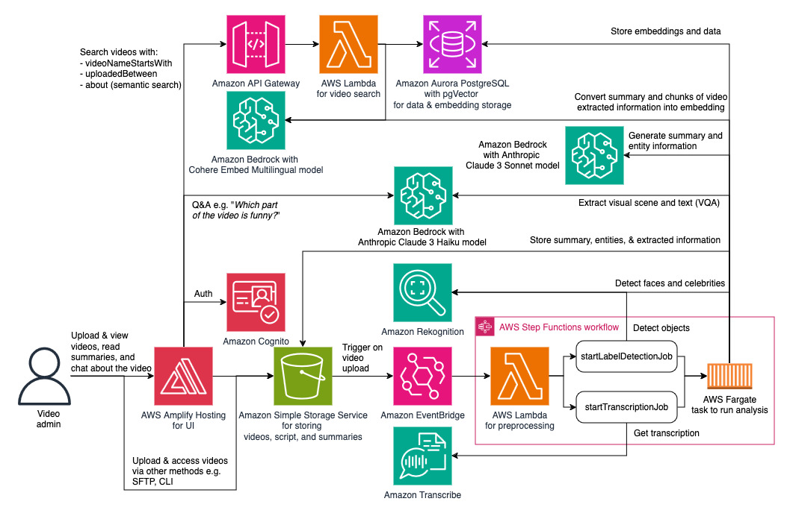

# Video Understanding Solution

## Introduction

This is a deployable solution which can help save your time in understanding the videos you have without having to watch every video. This solution automatically generate AI-powered summary and entities extraction of each video uploaded to your Amazon Simple Storage Service (S3) bucket. Not only that, it also allows you to ask questions about the video in a UI chatbot experience, like "How many people are in this video", "At which seconds does it talk about company's vision?". You can also use the search filter to search for videos using generative-AI-powered content/meaning similarity e.g. "video about Amazon's history". This solution extracts information from visual scenes, audio, and visible text in the video. 

You can upload videos to your S3 bucket by using AWS console, CLI, SDK, or other means (e.g. via AWS Transfer Family). This solution will automatically trigger processes by Amazon Rekognition and Amazon Transcribe to extract the visual scenes and texts and the audio transcription. This combined information is used to generate the summary and entities extraction as powered by generative AI with Amazon Bedrock. The UI chatbot also uses Amazon Bedrock to allows you to ask questions about the videos. The summaries, entities, and combined extracted information are stored in S3 bucket, available to be used for further custom analytics. Refer to the diagram below on the architecture.

Note that the architecture diagram may not represent all the components and relations for readability. The Amazon Aurora PostgreSQL database is deployed in Amazon VPC with isolated subnet spanning across 3 availability zones. The Fargate task for analysis, the video search Lambda function, and the preprocessing Lambda function are all deployed in the VPC with private subnet.

Refer to the Deployment section below on how to deploy it to your own AWS account. Refer to the Use section on how to use it.

## Deployment

### Prerequisites

Here are prerequisites for deploying this solution with AWS CDK:

1. AWS account with Amazon Bedrock model access enabled for Claude Instant and Titan Embeddings G1 - Text. Follow the steps in https://docs.aws.amazon.com/bedrock/latest/userguide/model-access.html#add-model-access to enable those models and make sure the region is correct.
2. Make 3.82 or above in your environment
3. AWS IAM credentials with sufficient permission for deploying this solution configured in your environment. See https://docs.aws.amazon.com/cli/latest/userguide/cli-configure-files.html for credentials setup.
4. AWS CLI 2.15.5 or above / 1.29.80 or above. Follow https://docs.aws.amazon.com/cli/latest/userguide/getting-started-install.html for installation.
5. Python 3.8 or above, pip, and virtualenv.
6. Docker 20.10.25 or above
7. NodeJS 16 with version 16.20.2 above, or NodeJS 20 with version 20.10.0 or above, along with NPM.
8. jq, zip, unzip
9. CDK Toolkit 2.122.0 or above. Follow https://docs.aws.amazon.com/cdk/v2/guide/getting_started.html#getting_started_install for installation.
10. Python CDK lib 2.122.0 or above with @aws-cdk/aws-amplify-alpha. Follow https://docs.aws.amazon.com/cdk/v2/guide/getting_started.html#getting_started_concepts
11. CDK nag 2.28.16 or above.

To automatically install item 4-11 of those prerequisites run. `make prepare`

The `make prepare` utility is currently supported only for MacOS Ventura, Amazon Linux 2, and Amazon Linux 2023 operating systems.

### Deploy

**IMPORTANT**

At the moment,this solution can only be used in AWS regions where Amazon Bedrock is available.
At the time of the writing of this document, you can deploy and use this in us-east-1 (N. Virginia) and us-west-2 (Oregon) regions.

Follow the steps below for deploying this solution from your current environment

1. Make sure that all prerequisites are met. Please refer to the [Prerequisites](#prerequisites) section above.

2. Run `make bootstrap_and_deploy` and enter an email address and the region to deploy when prompted. Make sure the email address is valid to receive the login credentials.

3. [Optional] For second or later redeployment, run `make deploy` instead. Note that any change to the UI (under "webui" folder) is not redeployed with `make deploy`. For UI changes you can push them to the deployed CodeCommit repository directly or run `make destroy` followed by `make deploy`.

## Use

After a successful deployment, the email address that you inputted during deployment should receive an email with temporary password and the web UI portal URL. Make sure the deployment is completed before going to the URL It can take 15 minutes or so after you receive the email until the deployment completion. Visit the URL, use the email address as username, and input the temporary password. It should lead you to password reset dialog. After a successful sign-in, you should be able to see the page that will display your uploaded videos.

You can upload videos into the S3 bucket using the UI. Or you can upload them straight to the S3 bucket using other means and folder "source" as instructed in the UI. Uploaded videos will automatically trigger asynchronous task. Wait for few minutes for the task to finish. The resulted analysis will be displayed in the web UI portal. It will also be stored in S3 under folder "summary", "entities", "audio_transcript" (the formatted transcription result), and "video_timeline" (the combined extracted video raw information).
 
In the Web UI portal, you can search for videos in your S3 bucket. For each video found, you can view the video, see its summary, see the extracted information by the seconds from Amazon Rekognition and Amazon Transcribe, and ask the chatbot about the video e.g. "How many people are in this video". The chatbot is equipped with memory for the current conversation, so the user can have a context-aware conversation with the bot.

## Cost
The cost of using this solution is determined by the pricing and usage of the components being deployed. This includes, but not necessarily being limited to:

1. Less variable components:
    1.1. Amazon Aurora PostgreSQL - Pricing is [here](https://aws.amazon.com/rds/aurora/pricing/). This solution by default uses 2 x 0.5 ACU of Aurora Serverless PostgreSQL.
    1.2. NAT Gateway - Pricing is [here](https://aws.amazon.com/vpc/pricing/). This is used for egress access of Fargate task and some Lambda function. By default this solution uses 1 NAT Gateway.
    1.3. Amazon Cognito - Pricing is [here](https://aws.amazon.com/cognito/pricing/). You may be eligible for its FREE TIER. This solution uses Cognito user pool and identity pool.
    1.4. AWS Secret Manager - Pricing is [here](https://aws.amazon.com/secrets-manager/pricing/). You may be eligible for its FREE TRIAL. This is used to store credentials.

2. More variable components (driven mainly by the total number of video minutes being processed and the activities e.g. chat):
    2.1. Amazon Rekognition - Pricing is [here](https://aws.amazon.com/rekognition/pricing/). You may be eligible for its FREE TIER for video analysis. This solution uses Stored Video Analysis for Label Detection and Text Detection. The cost can vary based on the video duration and the number of videos being processed.
    2.2. Amazon Transcribe - Pricing is [here](https://aws.amazon.com/transcribe/pricing/). Youo may be eligible for its FREE TIER. This solution uses Standard Batch transcription. The cost can vary based on the video duration and the number of videos being processed.
    2.3. Amazon Bedrock - Pricing is [here](https://aws.amazon.com/bedrock/pricing/). This solution uses Claude Instant and Titan Embeddings G1 - Text model. The cost can vary based on the amount of information extracted from the video and the usage frequency.
    2.4. Amazon S3 - Pricing is [here](https://aws.amazon.com/s3/pricing/). You may be eligible for its FREE TIER. S3 is used for storing the raw videos and the extracted information.
    2.5. AWS Fargate - Pricing is [here](https://aws.amazon.com/fargate/pricing/). Fargate task is where the extracted video information is being analyzed and where the calls to LLMs for summary and entities generation happen. It is provisioned on demand when a video is uploaded.
    2.6. AWS Lambda - Pricing is [here](https://aws.amazon.com/lambda/pricing/). You may be eligible for its FREE TIER. Lambda function is used in several parts of the worklflow, including to handle video search requests.
    2.7. Amazon API Gateway - Pricing is [here](https://aws.amazon.com/api-gateway/pricing/). You may be eligible for its FREE TIER.. API Gateway is used to power the video search API.
    2.8. AWS Step Functions - Pricing is [here](https://aws.amazon.com/step-functions/pricing/). You may be eligible for its FREE TIER. Step functions is used to orchestrate the video processing workflow.
    2.9. AWS Amplify - Pricing is [here](https://aws.amazon.com/amplify/pricing/). You may be eligible for its FREE TIER. This solution uses the Amplify for hosting the UI. See under "Host an app" part of the pricing page.
    2.10. Amazon CloudWatch - Pricing is [here](https://aws.amazon.com/cloudwatch/pricing/). You may be eligible for its FREE TIER. Amazon CloudWatch metrics and logs are used.
   
The main cost contributors are likely coming from Rekognition, Transcribe, and Bedrock for large number of long videos. It is recommended to test with smaller number of shorter videos first and observe the cost. It is recommended to monitor the cost with [AWS Cost Explorer](https://aws.amazon.com/aws-cost-management/aws-cost-explorer/) and set budget and alerts with [AWS Budget](https://aws.amazon.com/aws-cost-management/aws-budgets/). You can filter the cost by tagging with key = "Application" and value = "VideoUnderstandingSolution" to monitor the cost generated by this solution when deployed. Please note that some compnents may not be tagged or may not be taggable.

## Limitations

1. Currently only .mp4/.MP4 video files are supported
2. This solution is only tested on English videos.
3. Videos under 15 minutes work best. Longer video currently may have higher chat reply latency.
4. Video file names (when uploaded) must adhere to the [S3 object key pattern](https://docs.aws.amazon.com/AmazonS3/latest/userguide/object-keys.html). When uploaded via this solution's UI, it will automatically convert non-compliant characters to _ (underscore).

## Removal
To remove the solution from your AWS account, run `make destroy` and specify the region.

## Security

Run `make scan` before submitting any pull request to make sure that the introduced changes do not open a vulnerability. Make sure the generated banditreport.txt, semgrepreport.txt, semgreplog.txt, npmauditreport.txt, and the cdk_nag files in cdk.out folders all show **no high or critical finding**.

See [CONTRIBUTING](CONTRIBUTING.md#security-issue-notifications) for more information.

## License

This library is licensed under the MIT-0 License. See the LICENSE file.